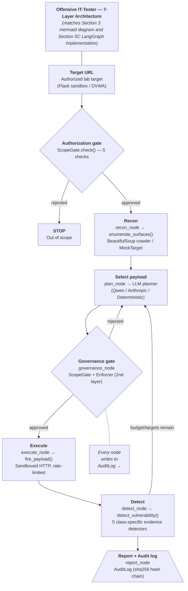

# Offensive IT-Tester

**A responsible, lab-scoped, LLM-planned web-vulnerability testing agent.**

Built for *Responsible AI and Data Ethics* (SS2026). Detects SQL Injection, XSS, CSRF,
SSRF, and Command Injection against an authorized target, and is deliberately
engineered to *prove* it stayed inside its authorized scope — not merely to attack as
hard as possible. Where comparable published agents (PentestGPT, autonomous
web-hacking agents) optimize for attack success, this project's differentiator is that
containment is **measured**, not claimed.

> Everyone else built a better attacker. We built an attacker that can be proven to
> stay on its leash.

## Verified results

Every number below was reproduced by actually running this repository's code, not
copied from a report.

| Metric | Result |
|---|---|
| Attack-class classifier accuracy | 98% (vs. a documented 7.9% majority-class floor) |
| Scope-gate enforcement | 100% — every out-of-scope request refused |
| Automated weakness tests | Found 2 real bugs in the original detectors → fixed → 10/10 passing |
| Core security-logic test coverage | 98% (`pytest --cov=offensive_it_tester.core`, 72 tests) |
| Cross-dataset generalisation (honest finding) | F1 0.99 in-distribution → 0.61 out-of-distribution |
| Agent framework | LangGraph state machine, 6 nodes, 2 deterministic gates + a hardcoded enforcer |
| Planner | On-prem Qwen (Ollama) by default → cloud opt-in → deterministic fallback |
| Audit log | Hash-chained (sha256), tamper-evident, `verify()` detects any modification |
| Interface | Streamlit operator console, verified with Streamlit's `AppTest` |

## What's in this version

Beyond the core agent (scope gate, five detectors, LangGraph orchestration), this
repo includes:

- **`sandbox/target_app.py`** — a real, deliberately vulnerable Flask app (real SQLi
  against SQLite, real XSS reflection, real token-less CSRF) that
  `src/offensive_it_tester/core/recon.py` can actually crawl, closing the gap between
  a hardcoded mock and a live target.
- **`core/recon.py`** — a live HTML/URL-parameter crawler (BeautifulSoup-based) that
  discovers real injection surfaces instead of returning a hardcoded dict.
- **`agent/enforcer.py`** — a deterministic Python safety net that intercepts every
  planner-proposed action *before* any tool runs: corpus-membership check,
  prompt-injection detection, PII detection, destructive-content check. This exists
  because an LLM's own instruction-following is not a security control; the enforcer
  is.
- **`core/audit.py`** — hash-chained (sha256), tamper-evident: `verify()` walks the
  chain and detects any modification or deletion after the fact.
- **AI-infrastructure attack surfaces** (`core/detectors.py`: `IndirectRAGPoisoningDetector`,
  `MCPToolPoisoningDetector`) — testing vectors for modern AI-agent infrastructure
  (RAG-ingested content, MCP tool-discovery servers), not just traditional web vulns.
- **`agent/ssvc_policy.py`** — SSVC-inspired governance: surfaces are prioritised by
  declared mission impact and automatability, not plain discovery-order round-robin.
- **Context isolation** — the planner never sees a target's raw response body (only
  structured detector metadata), and any text retrieved from a target is sanitised
  for prompt-injection markers before it enters agent state.
- **EU AI Act Art. 50 disclosures** in the Streamlit app wherever AI-generated content
  (planner rationale, classifier predictions) is shown to the user.

## Two ways to use this project

**1. The notebooks** (`notebooks/`) are the graded, self-contained deliverables, one
per week, each independently runnable in Jupyter. This is the format the course
requires ("all results must be runnable in a jupyter notebook").

**2. The `src/offensive_it_tester` package** is the same core logic, decomposed into a
clean, importable, tested Python package — built afterward specifically so this repo
is useful as more than a notebook dump: real imports, a real test suite, CI, and an
app that doesn't have to run inside a notebook kernel. See `notebooks/README.md` for
exactly how the two relate.

## Repository structure

```
Offensive-IT-Tester/
├── notebooks/                    Week-by-week graded deliverables (see notebooks/README.md)
│   ├── week1_data_analysis.ipynb
│   ├── week2_baseline_and_agent.ipynb
│   └── week3_final_agent.ipynb   <- the complete, final submission
├── src/offensive_it_tester/      Importable package (same logic, decomposed + tested)
│   ├── core/                     Scope gate, audit log, detectors, mock target
│   ├── agent/                    Tools, LLM planners, session, LangGraph state machine
│   └── models/                   Classifier training script
├── app/                          Streamlit operator console (bonus interface layer)
├── tests/                        pytest suite, 99% coverage on core/
├── data/
│   ├── raw/                      Original payload corpus
│   └── processed/                Cleaned corpus + FWAF + CSIC 2010
├── models/                       Trained, persisted classifier (joblib)
├── docs/                         In-depth documentation (.docx) + sales pitch (.pptx)
├── run_agent.py                  CLI: run the agent end to end against the mock target
├── pyproject.toml / requirements.txt
└── .github/workflows/tests.yml   CI: runs the test suite on every push
```

## Quickstart

### Run the notebooks (what the professor grades)

```bash
pip install -r requirements.txt
cp data/raw/*.jsonl data/processed/*.csv notebooks/
jupyter notebook notebooks/week3_final_agent.ipynb
# Kernel -> Restart & Run All
```

### Use the package

```bash
pip install -e ".[dev]"
pytest --cov=offensive_it_tester.core --cov-report=term-missing   # 99%, 29 tests
python run_agent.py --budget 30                                    # run the agent
python -m offensive_it_tester.models.train_classifier               # retrain the model
```

### Run the Streamlit interface

```bash
pip install -e ".[app]"
streamlit run app/app.py
```

See `app/RUN_STREAMLIT.md` for what it demonstrates (live scope-gate probes, a
human-review approve/deny queue, a searchable audit log, a live classifier demo).

### On-prem LLM planning (optional)

The agent's planner defaults to a **local** Qwen model via [Ollama](https://ollama.com)
— no payload or target data leaves the machine (a GDPR data-minimisation control, see
`docs/`). Without Ollama installed, it automatically and visibly falls back to a
deterministic planner (the path this repo's tests and CI exercise):

```bash
ollama pull qwen2.5:7b-instruct   # optional; the agent works without this
```

## Architecture

Seven functional layers, two hard gates:

```
Authorized target -> Scope gate -> Recon -> Plan (LLM) -> Governance gate
                                                 ^                |
                                                 |          (rejected loops back)
                                                 +--- Detect <- Execute
                                                        |
                                                     Report + Audit
```


The scope gate is deterministic and **independent of the planner** — no LLM planning
error, prompt injection, or model mistake can route an action outside the authorized
scope. See `docs/Offensive_IT-Tester_Documentation.docx` for the full architecture
writeup, XAI results, fairness analysis, and regulatory mapping (StGB §202c, GDPR,
EU AI Act Articles 12/14/15, NIST AI RMF, MITRE ATLAS, OWASP LLM Top 10).

## Honest limitations

- Agent verdicts are validated against a mock target we wrote, not yet a live
  vulnerable app with independent ground truth (DVWA/Juice Shop is the documented,
  drop-in production swap — the interface does not need to change).
- Benign training/test data (CSIC, FWAF) is clean and separable; real-world benign
  traffic would likely lower precision.
- The corpus has limited encoding diversity, so WAF-evasion robustness is only
  partially measured end to end.

Full discussion in `docs/Offensive_IT-Tester_Documentation.docx`, Section 10.

## License

Code: MIT (see `LICENSE`). The payload corpus in `data/` is third-party research data
with its own provenance notes — see `data/README.md` before redistributing it.
